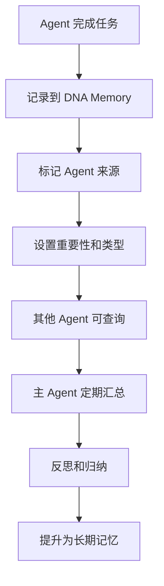

# 🤝 Multi-Agent DNA Memory 使用指南

> 让多个 AI Agent 共享记忆，实现团队协作和知识传承

## 核心理念

在 Multi-Agent 系统中，DNA Memory 不仅是单个 Agent 的记忆系统，更是**团队共享的知识库**：

- 📊 **研究部 Agent** 完成调研后，将成果记录到 DNA Memory
- 🎯 **主 Agent** 可以随时查询团队成员的工作进度
- 💡 **开发部 Agent** 可以学习研究部的技术方案
- 🔄 **所有 Agent** 共享错误教训，避免重复犯错

---

## 架构设计

### 1. 共享记忆库

所有 Agent 使用同一个 DNA Memory 实例：

```
~/.openclaw/skills/dna-memory/
├── memory/
│   └── memory.db          # 共享的 SQLite 数据库
├── scripts/
│   └── evolve.py          # 统一的记忆操作接口
└── assets/
    └── config.json        # 共享配置
```

### 2. 记忆标签系统

使用 `--tags` 标记记忆来源和类型：

```bash
# 研究部记录
python3 scripts/evolve.py remember \
  -t skill \
  -i 0.9 \
  --tags "研究部,技术方案,自动化" \
  "完成某项技术方案的研究和实现"

# 开发部记录
python3 scripts/evolve.py remember \
  -t error \
  -i 0.8 \
  --tags "开发部,GitHub,网络" \
  "GitHub push 超时需要重试机制"

# 主 Agent 记录
python3 scripts/evolve.py remember \
  -t preference \
  -i 0.95 \
  --tags "主Agent,用户偏好" \
  "用户喜欢简洁直接的回复"
```

### 3. 跨 Agent 查询

任何 Agent 都可以查询其他 Agent 的记忆：

```bash
# 查询研究部的工作成果
python3 scripts/enhanced_recall.py "研究部" --limit 10

# 查询所有错误记忆
python3 scripts/enhanced_recall.py --type error --limit 20

# 查询最近 7 天的记忆
python3 scripts/enhanced_recall.py --recent 7
```

---

## 实战案例：研究部 → 主 Agent 汇报

### 场景描述

- **研究部 Agent** 完成了某项技术调研
- 需要向 **主 Agent** 汇报工作进度
- 使用 DNA Memory 作为团队记忆中枢

### 实现步骤

#### 1. 研究部记录工作成果

```bash
cd ~/.openclaw/skills/dna-memory

# 记录调研报告
python3 scripts/evolve.py remember \
  -t fact \
  -i 0.8 \
  --tags "研究部,调研报告,市场分析" \
  "完成某项技术的市场调研报告，包含竞品分析、技术方案对比、成本预算等"

# 记录技术方案
python3 scripts/evolve.py remember \
  -t skill \
  -i 0.9 \
  --tags "研究部,技术方案,架构设计" \
  "设计了某项技术的实现方案，包含架构设计、技术选型、实施路线图"

# 记录工作模式
python3 scripts/evolve.py remember \
  -t pattern \
  -i 0.7 \
  --tags "研究部,工作模式,最佳实践" \
  "研究部工作模式：市场调研→技术方案设计→成本分析→实施路线图→交付报告"
```

#### 2. 主 Agent 查询团队进度

```bash
cd ~/.openclaw/skills/dna-memory

# 查询研究部最近的工作
python3 scripts/enhanced_recall.py "研究部" --recent 7 --limit 10

# 查询特定项目
python3 scripts/enhanced_recall.py "技术方案" --limit 5

# 查询所有技能记忆
python3 scripts/enhanced_recall.py --type skill --limit 20
```

#### 3. 自动化汇报机制

创建定时任务，每天两次向主 Agent 汇报：

```bash
# 创建汇报脚本
cat > ~/.openclaw/skills/dna-memory/scripts/report_to_main.sh << 'EOF'
#!/bin/bash

# 查询研究部最近 12 小时的工作
RECENT_WORK=$(python3 ~/.openclaw/skills/dna-memory/scripts/enhanced_recall.py \
  "研究部" --recent 0.5 --limit 5 --format json)

# 发送到主 Agent（通过飞书或其他渠道）
echo "研究部工作汇报："
echo "$RECENT_WORK"
EOF

chmod +x ~/.openclaw/skills/dna-memory/scripts/report_to_main.sh

# 配置 cron（每天 9:00 和 18:00 汇报）
# 0 9,18 * * * ~/.openclaw/skills/dna-memory/scripts/report_to_main.sh
```

---

## 最佳实践

### 1. 记忆命名规范

| Agent 类型 | 标签前缀 | 示例 |
|-----------|---------|------|
| 研究部 | `研究部,` | `研究部,调研报告,市场分析` |
| 开发部 | `开发部,` | `开发部,代码实现,GitHub` |
| 主 Agent | `主Agent,` | `主Agent,用户偏好,决策` |
| 运营部 | `运营部,` | `运营部,内容创作,数据分析` |

### 2. 重要性评分标准

| 重要性 | 分数 | 适用场景 |
|-------|------|---------|
| 关键决策 | 0.95-1.0 | 用户明确要求、核心偏好 |
| 重要技能 | 0.8-0.9 | 成功的技术方案、可复用的代码 |
| 一般事实 | 0.6-0.7 | 日常工作记录、普通信息 |
| 临时信息 | 0.3-0.5 | 短期有效的信息 |

### 3. 记忆类型选择

| 类型 | 用途 | 示例 |
|------|------|------|
| `fact` | 事实信息 | 调研报告、数据统计 |
| `skill` | 技能方案 | 技术实现、代码方案 |
| `pattern` | 工作模式 | 流程规范、最佳实践 |
| `error` | 错误教训 | 失败案例、避坑指南 |
| `preference` | 用户偏好 | 个人喜好、风格要求 |
| `insight` | 深层洞察 | 战略思考、商业判断 |

### 4. 定期维护

```bash
# 每天自动执行（通过 daemon）
python3 scripts/dna_memory_daemon.py start

# 或手动执行
python3 scripts/evolve.py reflect    # 归纳模式
python3 scripts/evolve.py decay      # 遗忘机制
python3 scripts/evolve.py dedupe     # 去重
```

---

## 团队协作流程

### 日常工作流



### 定期维护流程

```bash
# 每天 9:00 - 主 Agent 查看团队进度
python3 scripts/enhanced_recall.py --recent 1 --limit 20

# 每天 18:00 - 各 Agent 汇报工作
python3 scripts/report_to_main.sh

# 每周日 - 系统维护
python3 scripts/evolve.py reflect
python3 scripts/memory_quality.py cleanup --threshold 0.2
python3 scripts/memory_distillation.py distill
```

---

## 高级功能

### 1. 记忆质量评估

定期评估团队记忆质量：

```bash
# 生成健康度报告
python3 scripts/memory_quality.py report

# 清理低质量记忆
python3 scripts/memory_quality.py cleanup --threshold 0.2 --dry-run
```

### 2. 记忆关联图谱

发现团队知识之间的关联：

```bash
# 批量发现关联
python3 scripts/memory_graph.py batch --limit 100

# 查看特定记忆的关联网络
python3 scripts/memory_graph.py graph --id 123 --depth 2
```

### 3. 对抗性验证

检查团队记忆中的矛盾：

```bash
# 查找矛盾
python3 scripts/adversarial_validation.py find

# 自动解决矛盾
python3 scripts/adversarial_validation.py resolve --auto
```

### 4. 记忆蒸馏

合并相似的团队记忆：

```bash
# 分析蒸馏潜力
python3 scripts/memory_distillation.py analyze --threshold 0.75

# 执行蒸馏
python3 scripts/memory_distillation.py distill
```

---

## 常见问题

### Q1: 如何避免记忆冲突？

使用 `--tags` 明确标记记忆来源，使用对抗性验证检测矛盾：

```bash
python3 scripts/adversarial_validation.py find
```

### Q2: 如何控制记忆增长？

定期执行清理和蒸馏：

```bash
python3 scripts/memory_quality.py cleanup --threshold 0.2
python3 scripts/memory_distillation.py distill
```

### Q3: 如何实现跨 Agent 通知？

结合飞书、Slack 等消息平台，在记录重要记忆时发送通知。

### Q4: 如何备份团队记忆？

定期备份 SQLite 数据库：

```bash
python3 scripts/backup.py
```

---

## 实用技巧

### 1. 快速查询常用命令

```bash
# 查询最近的工作
alias recent="python3 ~/.openclaw/skills/dna-memory/scripts/enhanced_recall.py --recent 1"

# 查询特定 Agent
alias query-research="python3 ~/.openclaw/skills/dna-memory/scripts/enhanced_recall.py '研究部'"

# 查询错误记忆
alias errors="python3 ~/.openclaw/skills/dna-memory/scripts/enhanced_recall.py --type error"
```

### 2. 批量导入历史记忆

```bash
# 从 JSON 文件批量导入
python3 scripts/batch_import.py --file memories.json

# 从其他系统迁移
python3 scripts/migrate.py --source notion --api-key YOUR_KEY
```

### 3. 导出团队报告

```bash
# 导出最近 7 天的工作报告
python3 scripts/export_report.py --days 7 --format markdown

# 导出特定 Agent 的工作报告
python3 scripts/export_report.py --agent 研究部 --format pdf
```

---

## 未来规划

- [ ] **多租户支持**：不同团队使用独立的记忆空间
- [ ] **权限控制**：敏感记忆只对特定 Agent 可见
- [ ] **记忆同步**：支持分布式 Agent 的记忆同步
- [ ] **可视化面板**：Web UI 查看团队记忆图谱
- [ ] **智能推荐**：根据当前任务推荐相关记忆

---

## 总结

DNA Memory 的 Multi-Agent 模式让团队协作更高效：

✅ **知识共享**：所有 Agent 共享团队经验  
✅ **避免重复**：错误教训全员可见  
✅ **持续进化**：团队记忆不断优化  
✅ **透明协作**：工作进度实时可查  

**让 AI Agent 团队像人类团队一样协作和成长。**

---

## 相关文档

- [快速开始](QUICKSTART.md)
- [Evolver 集成指南](EVOLVER_INTEGRATION.md)
- [API 文档](API.md)

---

**让 Multi-Agent 系统真正协同进化**
